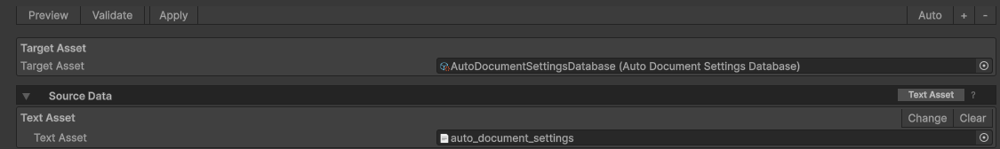
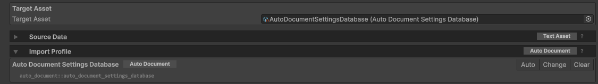
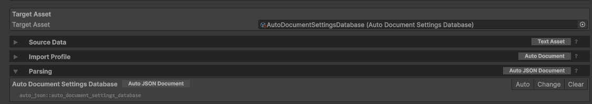
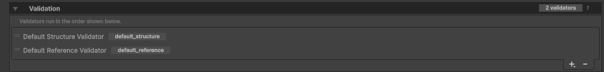
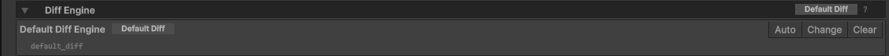
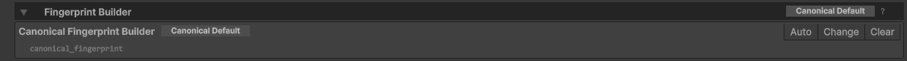
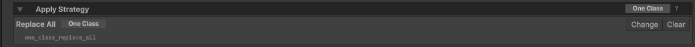
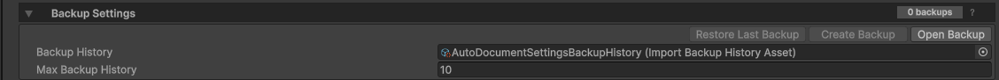
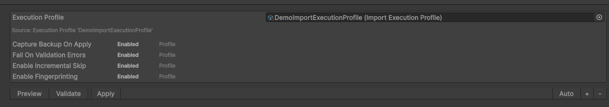
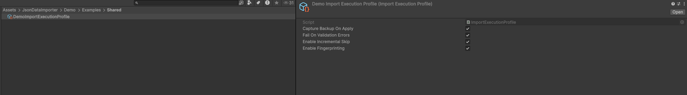

# ImportSourceConfig Reference

`ImportSourceConfig` is the settings asset for one import job. It stores the raw text source, target asset, selected pipeline components, backup/execution policy, and internal state for incremental skip.

Create it through the menu:

```text
Create > Json Data Importer > Import Source Config
```

Usually a developer assigns `targetAsset`, source provider, and source-specific fields, then presses `Auto` in the inspector. Auto-fill selects compatible profile/parser/apply strategy/diff/fingerprint components when the target asset supports the auto path.

## Required Fields By Mode

`Preview`, `Validate`, and `Apply` all start by building preview. The table below shows what must be configured, either explicitly or through a compatible auto/default resolver.

| Field | Preview | Validate | Apply |
| --- | --- | --- | --- |
| Source provider | Required | Required | Required |
| Target asset | Required | Required | Required |
| Parser | Required | Required | Required |
| Diff engine | Optional | Optional | Optional |
| Fingerprint builder | Optional | Optional | Required for incremental skip |
| Backup History | No | No | Required when backup capture is enabled |

## Source And Target Selection

### `sourceProvider`



Stored in code as private `[SerializeReference] IImportSourceProvider sourceProvider`. Shown in the inspector as `Source Data`.

The provider is responsible only for reading raw source text. It does not decide whether the content is JSON, CSV, or another text format. `IImportSourceProvider.ReadAsync(...)` returns `ImportSourceData`; the pipeline consumes `ImportSourceData.RawContent` as a `string`, and parsing is handled later by `selectedParserId`.

Built-in options:

```text
Text Asset
File Path
HTTP
```

For `Text Asset`, assign a text `TextAsset` containing the raw import payload. The file can contain JSON, CSV, or any other format for which a compatible parser exists. If provider is not assigned, the job finishes as invalid source provider. If `Text Asset` is selected but the TextAsset reference itself is missing, the job finishes as missing source.

For `File Path`, assign a path to a text file outside or inside the Unity project. For `HTTP`, assign a URL and optional request settings.

If data does not come from a built-in source, use a custom `IImportSourceProvider`: Google Sheets, an internal API, generated content, decrypted content, etc. The provider only needs to return raw text in `ImportSourceData.RawContent`; source-specific metadata such as `SourceDescriptor` and `FingerprintSha256` can be filled for diagnostics and incremental state.

See [Custom `IImportSourceProvider`](CustomImportExtensions.md#custom-iimportsourceprovider) for implementation requirements and an example provider.

### `targetAsset`

Unity asset that import data will be applied to.

The assigned target asset affects:

- list of compatible import profiles;
- auto adapter shape: collection, document, or direct fields;
- auto parser id;
- compatible validators/diff/fingerprint builders;
- backup capture and restore.

If `targetAsset` is not assigned, the job cannot even build preview and finishes as `MissingTarget`.


### `preferredTargetTypeId`



Stable id of the selected import profile/adapter. This is not a display name, but a technical id.

An import profile is the contract between an import job and a target asset. It defines which target type is being imported, which entry type the parser must produce, how target entries are read and written through the target adapter, how backup payloads are encoded, and which apply strategy is used by default.

Do not confuse this with `executionProfile`: the import profile chooses the target/data contract, while `executionProfile` only controls run policy such as backup, validation failure behavior, fingerprinting, and incremental skip.

Examples:

```text
auto_document::auto_document_settings_database
auto_list::plain_items_database
auto_direct_fields::direct_fields_database
hard_json_station_profile
```

If the field is empty, the resolver selects the first compatible profile. If there is only one compatible profile, the field can be left untouched. If there are several, select the desired profile in the inspector so the config is stable and does not depend on discovery order.

Related profile documentation:

- Auto profiles from target attributes: [Getting Started - What happens automatically](GettingStarted.md#4-what-happens-automatically) and [`[ImportTargetMetadata]`](ImportAttributes.md#importtargetmetadatatargettypeid-displayname-entrytype).
- When a custom adapter/profile is needed: [Getting Started - When a Custom Target Adapter/Profile Is Needed](GettingStarted.md#6-when-a-custom-target-adapterprofile-is-needed).
- Full custom `IImportProfile` template and requirements: [Custom `IImportProfile`](CustomImportExtensions.md#custom-iimportprofile).
- Runtime profile resolution flow: [Import Execution Flow - BuildPreviewCoreAsync](ImportExecutionFlow.md#4-buildpreviewcoreasync).
- Pipeline stages that depend on the selected profile: [Pipeline Stages And Extension Points](PipelineStagesAndExtensionPoints.md).
- Inspector display names and profile badges: [Editor Display Names And Badges](EditorDisplayNamesAndBadges.md).

## Pipeline Selection

These fields define which pipeline components are used after source data is read.

### `selectedParserId`



Id of the parser that turns raw source text from `ImportSourceData.RawContent` into entries of the required `EntryType`.

If the field is empty, the resolver first tries the auto parser for the target. For an auto document target, this is:

```text
auto_json::<targetTypeId>
```

If auto parser is impossible and `selectedParserId` is empty, the job fails: parser is not selected and no auto parser was found. See [Custom `IImportParser`](CustomImportExtensions.md#custom-iimportparser) when the source shape needs custom parsing.

CSV is handled as a parser choice over the same raw text source model. A `.csv` `TextAsset` or `File Path` source can use the auto CSV parser:

```text
auto_csv::<targetTypeId>
```

For example:

```text
auto_csv::plain_items_database
```

Auto-fill can prefer the auto CSV parser when the configured source points to a `.csv` file. For HTTP, Google Sheets, generated content, or any custom source provider that returns CSV text without a file path, select the auto CSV parser explicitly or provide a custom parser.

Fill the field explicitly when:

- JSON or CSV/source shape does not fit the auto parser;
- a custom parser exists;
- a specific parser needs to be fixed even when an auto candidate exists.

### `selectedValidatorIds`



List of validator ids that run during preview, validate, and apply flow.

Validation checks parsed source entries before they are applied to the target asset. Validators receive the prepared source entries, current target entries, target/profile metadata, identity strategy, and reference lookup context, then return `ImportValidationMessage` diagnostics. Error diagnostics can block `Validate` and `Apply` when fail policy is enabled; warning diagnostics stay visible but do not block by themselves.

Default list:

```text
default_structure
default_reference
```

If the list is empty, validation is disabled and preview gets a warning that validators are not configured. If an id is not found, duplicated, or incompatible with entry type, the job fails during pipeline resolution.

Validator order only affects diagnostics order. Validators read source/target entries and return diagnostics. See [Custom Validator](CustomImportExtensions.md#custom-validator) for project-specific checks.

Related validation documentation:

- Built-in field validation attributes: [Required Fields](ImportAttributes.md#required-fields), [References](ImportAttributes.md#references), and [`[ImportValidationIgnore]`](ImportAttributes.md#importvalidationignore).
- Custom validator implementation: [Custom Validator](CustomImportExtensions.md#custom-validator).
- Validator discovery metadata: [`[ImportValidatorMetadata]`](ImportAttributes.md#importvalidatormetadatavalidatorid-displayname-entrytype).
- Validation stage, parser diagnostics, and reference lookup context: [Pipeline Stages And Extension Points](PipelineStagesAndExtensionPoints.md#preview-stages), [Parser Diagnostics Become Validation Messages](PipelineStagesAndExtensionPoints.md#parser-diagnostics-become-validation-messages), and [Reference Lookup Runs Before Validation](PipelineStagesAndExtensionPoints.md#reference-lookup-runs-before-validation).
- Fail policy: [`failOnValidationErrors`](#failonvalidationerrors).
- Runtime validate/apply behavior: [ValidateOnly](ImportExecutionFlow.md#7-validateonly) and [Apply](ImportExecutionFlow.md#8-apply).
- Blocking statuses and recovery: [ValidationFailed And ApplyBlocked](ImportJobStatusTroubleshooting.md#validationfailed-and-applyblocked).
- CI validation and exit codes: [CI Commands](CICommands.md#single-importsourceconfig) and [Exit Codes](CICommands.md#exit-codes).

### `selectedDiffEngineId`



Id of the diff engine that builds preview changes.

A diff engine compares prepared source entries with current target entries and returns preview changes such as added, updated, removed, and unchanged entries. It can also return diff diagnostics for comparison problems. Diff is for preview/reporting: it does not parse source data, validate business rules, change the target asset, choose the apply strategy, or decide incremental skip.

Usually:

```text
default_diff
```

The current resolver does not create a diff engine when the field is empty. In that case, preview is built without diff changes and adds a warning that diff is disabled. For normal preview, select a compatible diff engine through `Auto`.

A custom diff engine is used when standard field/identity comparison is not enough. See [Custom Diff Engine](CustomImportExtensions.md#custom-diff-engine).

Related diff engine documentation:

- Custom diff implementation: [Custom Diff Engine](CustomImportExtensions.md#custom-diff-engine).
- Field-level diff controls: [Normalization And Comparison](ImportAttributes.md#normalization-and-comparison) and [Excluding Members From Pipeline Stages](ImportAttributes.md#excluding-members-from-pipeline-stages).
- Diff engine discovery metadata: [Import Attributes - Extension Discovery Attributes](ImportAttributes.md#extension-discovery-attributes).
- Pipeline position and failure isolation: [Preview Stages](PipelineStagesAndExtensionPoints.md#preview-stages) and [Diff Failures Are Isolated](PipelineStagesAndExtensionPoints.md#diff-failures-are-isolated).
- Runtime preview flow: [ImportJobCorePipeline.BuildPreview](ImportExecutionFlow.md#5-importjobcorepipelinebuildpreview).
- Diff diagnostics and result counters: [ImportJob Status Troubleshooting - How To Read ImportJobResult](ImportJobStatusTroubleshooting.md#how-to-read-importjobresult).
- CI reports and exit codes: [Reports](CICommands.md#reports) and [Exit Codes](CICommands.md#exit-codes).
- Inspector display names and badges: [Editor Display Names And Badges](EditorDisplayNamesAndBadges.md).

### `selectedFingerprintBuilderId`



Id of the fingerprint builder that computes canonical source/target fingerprints.

A fingerprint builder turns a set of entries into a deterministic fingerprint string. The runner uses it to fingerprint prepared source entries and current target entries, then compares those values with `lastApplied*` state to decide whether `Apply` can be skipped as unchanged. A fingerprint builder does not parse source data, validate records, build preview diff, write the target asset, or decide apply strategy; it only defines what data counts as relevant for change detection.

Usually:

```text
canonical_fingerprint
```

If the field is empty, a fingerprint builder is not created. If `executionProfile.enableFingerprinting == true`, preview adds a warning that fingerprinting is disabled because no fingerprint builder is configured. Without fingerprints, incremental skip cannot reliably skip unchanged apply.

Fill the field through `Auto` when you want to use incremental skip and last applied state. See [Custom Fingerprint Builder](CustomImportExtensions.md#custom-fingerprint-builder) when canonical fingerprints need custom rules.

Related fingerprint documentation:

- Custom fingerprint implementation: [Custom Fingerprint Builder](CustomImportExtensions.md#custom-fingerprint-builder).
- Fingerprinting policy switches: [`enableFingerprinting`](#enablefingerprinting) and [`enableIncrementalSkip`](#enableincrementalskip).
- Internal state that stores fingerprints: [Internal Incremental State](#internal-incremental-state) and [Backup / Restore / Incremental State - lastApplied* State](BackupRestoreIncrementalState.md#lastapplied-state).
- Incremental skip conditions and failure cases: [When Incremental Skip Works](BackupRestoreIncrementalState.md#when-incremental-skip-works) and [When Incremental Skip Does Not Work](BackupRestoreIncrementalState.md#when-incremental-skip-does-not-work).
- Field-level fingerprint controls: [Normalization And Comparison](ImportAttributes.md#normalization-and-comparison) and [`[ImportFingerprintIgnore]`](ImportAttributes.md#importfingerprintignore).
- Fingerprint builder discovery metadata: [Import Attributes - Extension Discovery Attributes](ImportAttributes.md#extension-discovery-attributes).
- Pipeline position and data dependencies: [Preview Stages](PipelineStagesAndExtensionPoints.md#preview-stages), [Apply Stages](PipelineStagesAndExtensionPoints.md#apply-stages), and [Non-Obvious Data Dependencies](PipelineStagesAndExtensionPoints.md#non-obvious-data-dependencies).
- Runtime preview/apply flow: [BuildPreviewCoreAsync](ImportExecutionFlow.md#4-buildpreviewcoreasync) and [ApplyPreparedCore](ImportExecutionFlow.md#9-applypreparedcore).
- CI overrides for incremental skip and fingerprinting: [CI Commands - Incremental Skip And Fingerprinting](CICommands.md#incremental-skip-and-fingerprinting).
- Troubleshooting skipped apply: [ImportJob Status Troubleshooting - Skipped](ImportJobStatusTroubleshooting.md#skipped).

### `selectedApplyStrategyId`



Id of the apply strategy that builds final entries before writing to the target.

An apply strategy decides how prepared source entries and current target entries become the final entry list. For example, it can replace everything, merge by identity, patch only existing entries, or append only new entries. It does not write to the Unity asset directly; after `BuildFinalEntries(...)` returns, the selected target adapter writes the final entries through `TargetAdapter.SetTargetEntries(...)`.

Examples:

```text
replace_all
merge_by_identity
patch_existing_only
append_new_only
one_class_replace_all
one_class_merge_by_identity
one_class_patch_existing_only
one_class_append_new_only
```

Runtime resolution order:

```text
1. ImportJobDefinition.OverrideApplyStrategy, when supplied by code.
2. selectedApplyStrategyId, when it is not empty and ImportApplyStrategyRegistry finds the id.
3. IImportProfile.GetDefaultApplyStrategy() from the resolved profile.
4. Failed, if no strategy is resolved.
```

If `selectedApplyStrategyId` is empty, the runner uses the default strategy from the resolved profile. If `selectedApplyStrategyId` is set but the id is no longer registered, runtime falls back to the profile default strategy. If that fallback is also missing, apply fails before changing the target asset.

For auto document/direct-fields, a one-class strategy is usually needed; for collection targets, a collection strategy is usually needed. Custom profiles can provide a default strategy through `IImportProfile.GetDefaultApplyStrategy()`; see [Custom `IImportProfile`](CustomImportExtensions.md#custom-iimportprofile).

Related apply strategy documentation:

- Custom apply strategy implementation and registration: [Custom Apply Strategy](CustomImportExtensions.md#custom-apply-strategy).
- How profiles provide a default strategy: [Custom `IImportProfile`](CustomImportExtensions.md#custom-iimportprofile).
- Apply pipeline position and target write boundary: [Apply Stages](PipelineStagesAndExtensionPoints.md#apply-stages) and [Apply Uses Only Prepared Source](PipelineStagesAndExtensionPoints.md#apply-uses-only-prepared-source).
- Runtime apply flow: [Apply](ImportExecutionFlow.md#8-apply) and [ApplyPreparedCore](ImportExecutionFlow.md#9-applypreparedcore).
- Incremental skip state includes strategy id: [`lastAppliedApplyStrategyId`](#lastappliedapplystrategyid) and [Backup / Restore / Incremental State - lastApplied* State](BackupRestoreIncrementalState.md#lastapplied-state).
- Safe apply failure points: [Backup / Restore / Incremental State - Why Apply Can Fail Before Target Changes](BackupRestoreIncrementalState.md#why-apply-can-fail-before-target-changes).
- Missing strategy troubleshooting: [ImportJob Status Troubleshooting - Failed](ImportJobStatusTroubleshooting.md#failed).
- Inspector display names and badges: [Editor Display Names And Badges](EditorDisplayNamesAndBadges.md).

## Backup And Execution

### `backupHistory`



Asset where backup snapshots are saved before apply.

If backup capture is enabled, `backupHistory` is required. Without it, apply fails before changing the target asset:

```text
Backup capture is enabled, but Backup History asset is not assigned.
```

If backup capture is disabled in `executionProfile` or a runtime override, `backupHistory` can be empty, but restore for that run will be impossible. Safe apply, restore, and `lastApplied*` state are described in [Backup / Restore / Incremental State](BackupRestoreIncrementalState.md).

### `executionProfile`





`ImportExecutionProfile` asset for preview/validate/apply behavior.

Create the asset through the Unity menu:

```text
Create > Json Data Importer > Import Execution Profile
```

It is assigned to `ImportSourceConfig.executionProfile` and affects how `ImportJobRunner` behaves in `Preview`, `Validate`, and `Apply` modes. The profile does not choose target, parser, diff engine, fingerprint builder, or apply strategy; it only controls execution policy.

> Important: if `executionProfile` is not assigned, all boolean policy values are treated as `true`. With default settings, `Apply` requires `backupHistory` because `captureBackupOnApply` is also `true`.

```text
captureBackupOnApply = true
failOnValidationErrors = true
enableIncrementalSkip = true
enableFingerprinting = true
```

All boolean settings use the same priority order:

```text
ImportJobDefinition override / ImportBatchRunOptions override
-> ImportSourceConfig.executionProfile
-> default true
```

That means a batch run or manual code can temporarily override the profile value. If no override is set and `executionProfile` is not assigned, `true` is used.

#### `captureBackupOnApply`

Enables backup snapshot creation before real `Apply`.

If `true`, before changing the target asset, the runner calls backup capture through `ImportSourceConfig.TryCaptureBackup(...)`. For this, the config requires an assigned `backupHistory`; otherwise apply fails before target changes. The number of saved snapshots is limited by `ImportSourceConfig.maxBackupHistory`.

If `false`, apply runs without creating a backup. This removes the requirement to assign `backupHistory`, but rollback through backup history will be impossible for that run.

This field does not affect `Preview` or `Validate`.

#### `failOnValidationErrors`

Controls whether validation errors block further execution.

If `true`, `Validate` mode returns a failure status when validation errors exist, and `Apply` mode stops before changing the target asset. Validation warnings do not block apply by themselves.

If `false`, validation errors remain in preview/result diagnostics, but validate/apply can continue. This is useful for diagnostic runs or migrations where errors need to be visible without stopping the whole job.

#### `enableIncrementalSkip`

Allows apply to be skipped when data has not changed.

If `true`, before apply the runner compares current canonical fingerprints with the last successful apply state in `ImportSourceConfig`. If source fingerprint, target fingerprint, target profile id, and apply strategy match, the job gets status `Skipped`, the target asset is not changed, and no backup is created.

If `false`, the runner always reaches the apply step after preview/validation checks, even when fingerprint state says data did not change.

The field is effective only when fingerprinting is enabled and fingerprints were computed. If fingerprints are missing, incremental skip does not work.

#### `enableFingerprinting`

Enables canonical fingerprint calculation for source and target.

If `true`, preview/apply tries to resolve a fingerprint builder, compute canonical source/target fingerprints, and save last applied state after successful apply. That state is later used by `enableIncrementalSkip`.

If `false`, the fingerprint builder is not used, canonical fingerprints are not computed, and incremental skip effectively has no data to compare. After apply, last applied state can be cleared because the runner cannot reliably confirm source/target state.

Disabling fingerprinting makes sense only when fingerprint calculation is too expensive, unsupported for a specific target, or incremental skip is intentionally unnecessary for the run.

### `maxBackupHistory`

Maximum number of backup snapshots stored in the assigned `backupHistory`.

Used only by `TryCaptureBackup(...)`. If backup capture is disabled or `backupHistory` is not assigned, the field has no effect.

Practical default:

```text
10
```

## Internal Incremental State

These fields are visible in the serialized asset, but normally are not edited manually.

### `lastAppliedSourceFingerprint`

Canonical fingerprint of source entries after the last successful apply.

Used together with target fingerprint, profile id, and apply strategy id. If source data changes, the fingerprint changes, and the next apply will not be skipped.

### `lastAppliedTargetFingerprint`

Canonical fingerprint of target entries after the last successful apply.

Needed so incremental skip does not skip apply when the target asset was manually changed after the previous import.

### `lastAppliedProfileTargetTypeId`

`TargetTypeId` of the profile used during the last successful apply.

If the config switches to another profile/adapter, incremental skip does not work even when fingerprints match.

### `lastAppliedApplyStrategyId`

Id of the apply strategy used during the last successful apply.

If the strategy changed, the next apply runs as changed because final entries can be built differently.

### `lastAppliedAtUtc`

UTC timestamp of the last successful apply in round-trip ISO 8601 format.

This is a diagnostic field. It does not participate in incremental skip comparison.

## When State Is Updated Or Cleared

After successful apply, the runner tries to compute final source/target fingerprints.

If fingerprints are computed, the config updates:

```text
lastAppliedSourceFingerprint
lastAppliedTargetFingerprint
lastAppliedProfileTargetTypeId
lastAppliedApplyStrategyId
lastAppliedAtUtc
```

If fingerprints cannot be computed, the runner clears last applied state. After that, the next apply runs as changed because reliable fingerprint state is missing.

Clearing the last applied state forces the next `Apply` to run instead of being skipped. It does not disable incremental skip for later runs. Manually editing fingerprint strings can cause an incorrect skip.

## Short Checklist

- Source provider and its source-specific fields are assigned.
- `targetAsset` is assigned.
- `preferredTargetTypeId` is selected when there is more than one profile.
- `selectedParserId` is selected or auto parser is possible.
- `selectedValidatorIds` is not empty when validation is needed.
- `selectedDiffEngineId` is selected when preview diff is needed.
- `selectedFingerprintBuilderId` is selected when incremental skip is needed.
- `selectedApplyStrategyId` is compatible with target shape.
- `backupHistory` is assigned when backup capture is enabled.
- `executionProfile` is assigned when policy values need to differ from default true.
- `lastApplied*` fields are not edited by hand.
