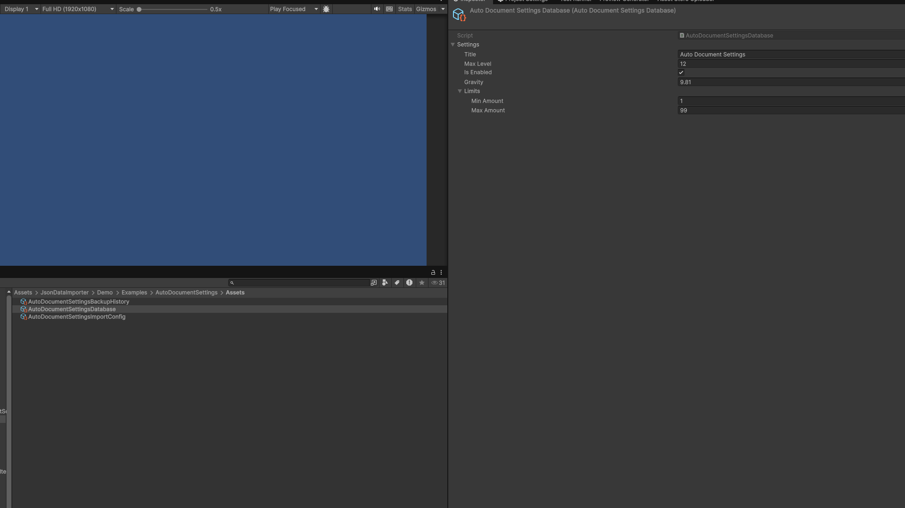
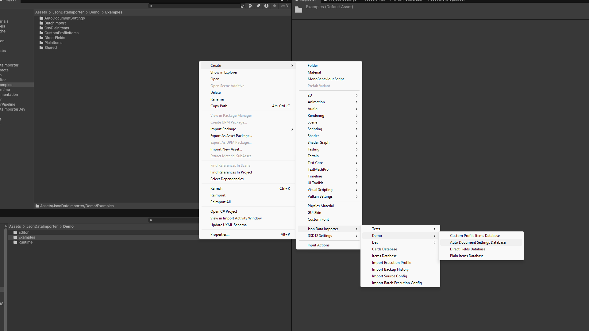
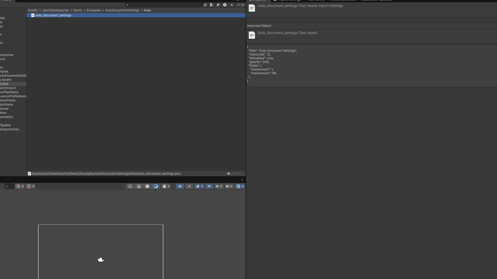
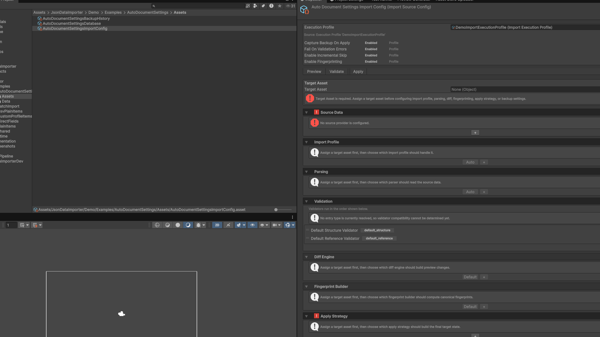
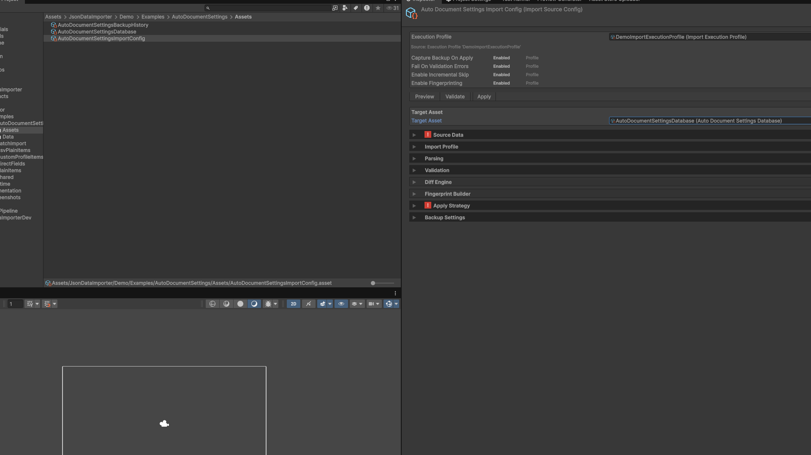
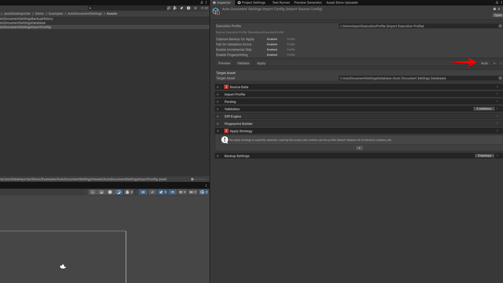
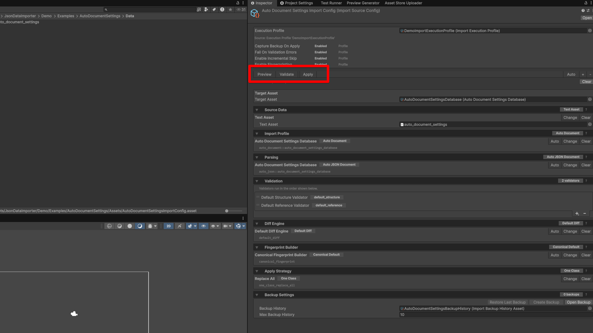
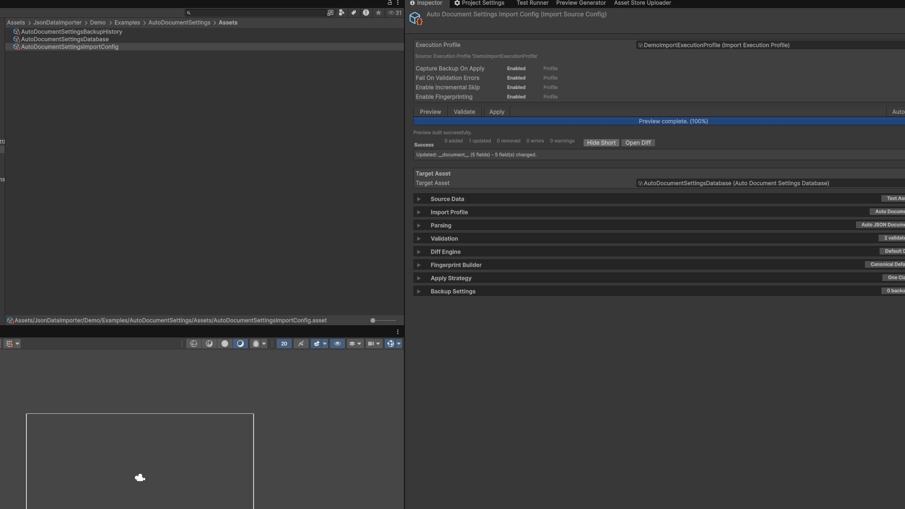

# Json Data Importer - Quick Start

In this guide, you will import one JSON object into a `ScriptableObject` by using
the automatic document-import path.

The data flow is:

```text
JSON TextAsset
-> Parser
-> Preview and validation
-> Apply strategy
-> Target ScriptableObject
```

By the end of the guide, values from the JSON file will be visible in the
`AutoDocumentSettingsDatabase` asset.

## 1. Prepare the Data Type

Create a serializable C# type that matches the JSON shape.

```csharp
using System;

namespace Game.Import
{
    [Serializable]
    public sealed class AutoDocumentSettings
    {
        public string title;
        public int maxLevel;
        public bool isEnabled;
        public float gravity;
        public AutoDocumentLimits limits;
    }

    [Serializable]
    public sealed class AutoDocumentLimits
    {
        public int minAmount;
        public int maxAmount;
    }
}
```

Example JSON:

```json
{
  "title": "Auto Document Settings",
  "maxLevel": 12,
  "isEnabled": true,
  "gravity": 9.81,
  "limits": {
    "minAmount": 1,
    "maxAmount": 99
  }
}
```

When using the automatic JSON import path, public C# field names should exactly match the corresponding JSON property names.



## 2. Create the Target ScriptableObject

Create a `ScriptableObject` class that stores a single imported document.

```csharp
using JsonDataImporter.Runtime.Core.Metadata;
using UnityEngine;

namespace Game.Import
{
    [ImportTargetMetadata(
        "auto_document_settings_database",
        "Auto Document Settings Database",
        typeof(AutoDocumentSettings))]
    [CreateAssetMenu(
        fileName = "AutoDocumentSettingsDatabase",
        menuName = "Game/Import/Auto Document Settings Database")]
    public sealed class AutoDocumentSettingsDatabase : ScriptableObject
    {
        [ImportTargetDocument]
        public AutoDocumentSettings settings;
    }
}
```

What these attributes do:

- `[ImportTargetDocument]` marks the field that receives one JSON object.
- `[ImportTargetMetadata]` makes this target discoverable by the importer.
- `"auto_document_settings_database"` is a stable ID stored in import configurations.
- `"Auto Document Settings Database"` is the editor display name.
- `typeof(AutoDocumentSettings)` tells the importer which type to use when parsing and applying the JSON data.

After Unity finishes recompiling, create the target asset from the custom menu:

```text
Create > Game > Import > Auto Document Settings Database
```



## 3. Add the JSON Source

Place the JSON file somewhere inside the `Assets` folder, for example:

```text
Assets/Game/Data/auto_document_settings.json
```

Unity imports `.json` files as `TextAsset` objects, so the JSON file can be assigned to the importer configuration.



## 4. Create the Import Config

Create an import configuration asset:

```text
Create > Json Data Importer > Import Source Config
```

Select the newly created `ImportSourceConfig` asset. Its `Inspector` lets you configure the JSON source, target database, and import pipeline options.



Assign the database asset you created to the `Target Asset` field. This tells the configuration which `ScriptableObject` should receive the imported data.
Until `Target Asset` is assigned, the importer cannot automatically select a compatible import profile or parser.



## 5. Configure the Import Config

Follow this setup order:

1. Assign `Target Asset`.
2. Set `Source Data` to `Text Asset`.
3. Assign the JSON file to `Text Asset`.
4. Click the top-level `Auto` button.
5. Verify `Apply Strategy`.
6. Before the first `Apply`, assign a `Backup History` asset or disable backup capture through an `Execution Profile`.
7. Run `Preview`.

Use the following recommended configuration for this example:

| Field / Section | What to set | Short explanation |
| --- | --- | --- |
| `Target Asset` | Your `AutoDocumentSettingsDatabase.asset` | The asset that will receive imported data. |
| `Source Data` | `Text Asset` | Reads JSON from a Unity `TextAsset`. |
| `Text Asset` | Your `.json` file | The source JSON file. |
| `Import Profile` | Filled by the top-level `Auto` button | Automatically selects a compatible document import profile for the target. |
| `Parser` | Filled by the top-level `Auto` button | Automatically selects a compatible JSON document parser. |
| `Validators` | Keep defaults | Runs the default structure and reference checks. |
| `Diff Engine` | Click `Default` if empty | Generates a preview of the changed fields. |
| `Fingerprint Builder` | Click `Default` if empty | Detects whether the source data has changed. |
| `Apply Strategy` | Select `Replace All (One Class)` (`one_class_replace_all`) | Replaces the single document in the target asset. |

Optional safety settings:

| Field / Section | What to set | Short explanation |
| --- | --- | --- |
| `Backup History` | Assign before the first `Apply`, unless backup capture is disabled | Stores a snapshot before the target data is changed. |
| `Execution Profile` | Optional policy override | Controls backup, validation, fingerprinting, and skip behavior. Without one, backup capture is enabled by default. |

By default, backup capture is enabled even when no `Execution Profile` is assigned. Before the first `Apply`, either assign a `Backup History` asset or assign an `Execution Profile` with `Capture Backup On Apply` disabled.

Create the backup history asset through this menu:

```text
Create > Json Data Importer > Import Backup History
```

After assigning `Target Asset` and `Source Data`, the top-level `Auto` button provides the fastest setup path.
It can populate the `Import Profile`, `Parser`, `Diff Engine`, and `Fingerprint Builder` sections with compatible options.
If `Apply Strategy` is still empty after that, select `Replace All (One Class)`.



## 6. Run the Import

Use the action buttons at the top of the `ImportSourceConfig` Inspector.

| Button | What it does | Changes target asset? |
| --- | --- | --- |
| `Preview` | Builds a fresh preview, shows validation diagnostics, and displays the diff. It is intended for inspecting the planned result. | No |
| `Validate` | Runs the same preview pipeline but reports whether validation passed or failed. It is useful as an explicit validation check and in automated workflows. | No |
| `Apply` | Builds a fresh preview again, checks validation and backup requirements, and writes the final data when the job is not blocked or skipped. | Yes |

Each button starts a new import job. `Apply` does not reuse the previously displayed `Preview` result.



Recommended first run:

1. Press `Preview`.
2. Fix any errors shown in the `Diagnostics` section.
3. Press `Validate`.
4. If using default backup capture, assign a `Backup History` asset or assign an `Execution Profile` with `Capture Backup On Apply` disabled.
5. Press `Apply`.
6. Select the target database asset and confirm that the imported values were written correctly.




This is the shortest path for importing one JSON document into a `ScriptableObject`.
For custom parsers, collections, CI workflows, backups, and troubleshooting, see the [Getting Started](GettingStarted.md) and [Custom Import Extensions](CustomImportExtensions.md) guides.

## Expected Result

The values from `auto_document_settings.json` are now visible in the `AutoDocumentSettingsDatabase` asset.

## Glossary

| Term | Meaning |
| --- | --- |
| Import Profile | Defines the target type, entry type, adapter, backup codec, and default apply strategy. |
| Execution Profile | Defines backup, validation, fingerprinting, and incremental policy. |
| Raw Source Fingerprint | Hash of the original source text returned by the source provider. |
| Canonical Fingerprint | Hash of the normalized parsed entries. |
| Diff Engine | Builds only the preview/report; it does not decide what `Apply` writes. |
| Apply Strategy | Builds the final entry set; the adapter writes it to the target asset. |

## Quick Troubleshooting

- `Auto` does not select anything: check that the target class has `[ImportTargetMetadata]`, the document field has `[ImportTargetDocument]`, and that Unity has finished compiling without errors.
- `Preview` cannot parse the JSON: check that the JSON root is an object and its field names match the C# type.
- `Apply` reports that backup setup is required: assign `Backup History` or use an `Execution Profile` with `Capture Backup On Apply` disabled.
- For lists, custom source shapes, HTTP sources, Google Sheets, CI, or custom validation, see [Custom Import Extensions](CustomImportExtensions.md).
